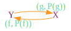
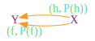

# Category Theory and Performance

Imagine for a second that we understand [Category Theory][ct]. Now imagine that we
have a fancy [category][cat], representing a part of a program, with two objects `X`
and `Y` (representing the input and output types of our program respectively),
and morphisms `f : X -> Y` and `g : Y -> X` (because this is a category). This
is what we have:

Imagine now that there's a (reasonable) way to determine if two morphisms are
equal. Given `f, g : X -> Y`: `f = g <=> forall x in X: f(x) = g(x)`.

Imagine there's also a way to analyze performance of a given morphism. We'll
represent the performance of a given morphism `f` as `P(f)`. The lesser P(f)
is, for any given morphism, the better.

We'll analyze all morphisms of our category, and annotate them with their
performance. We'll represent an annotated morphism `f` as `(f, P(f))`. Like so:

For this post, I'll say that "two morphisms are equal" to mean the condition
above, that two morphisms "behave" in the same way; and I'll say that "two
morphisms are the same", iff they're really the same. Think of two different
implementations of a certain abstract algorithm. Both implementations perform
the same operation, but they're not the same implementation; they (may
possibly) have different properties. We're interested in performance here.

So, two equal morphisms `f` and `g` do not necessarily have equal performance:
`f = g =/> P(f) = P(g)`.

Obviously, `P(f) = P(g) =/> f = g`, and `P(f) != P(g) =/> f != g`, but this
doesn't add much to our toolbox.

Now, from our original category, we'll forsake `g`, because who cares, and
we'll add to it a morphism `h` equal to `f`.

Because `f = h`, improving the performance of our program, without changing its
results, consists in choosing the morphism with better performance. If
`P(f) < P(h)`, choose `f`; if `P(h) < P(f)`, choose `h`; otherwise, ask
your mirror for the prettier of the two.

"What's this all good for?" you may ask! Nothing, really, if you don't use it.
We like imagining, so we'll do it once more: there's a complicated (imaginary)
category representing our complicated (imaginary) program, with performance
annotations. The program takes an input `I` and transforms it into some output
`O`. For simplicity, we'll only represent the most performant morphism between
each two objects. And because naming is hard, a morphism between `X` and `Y`
will be named `xy`: `xy : X -> Y`.

Omitted labels because they clutter too much. {X, Y, Z, W} form a complete
graph. Now finding the most performant way to write our program, is finding the
shortest weighted path between `I` and `O`. The hardest part is coming up with
different implementations and analyzing their performance, really, because even
a _computer_ can find the best way to write the program.

[ct]: https://en.wikipedia.org/wiki/Category_theory
[cat]: https://en.wikipedia.org/wiki/Category_(mathematics)
